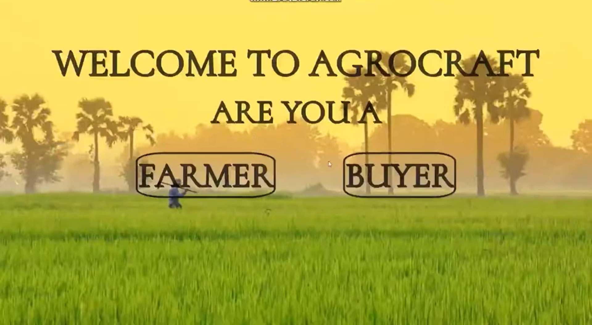
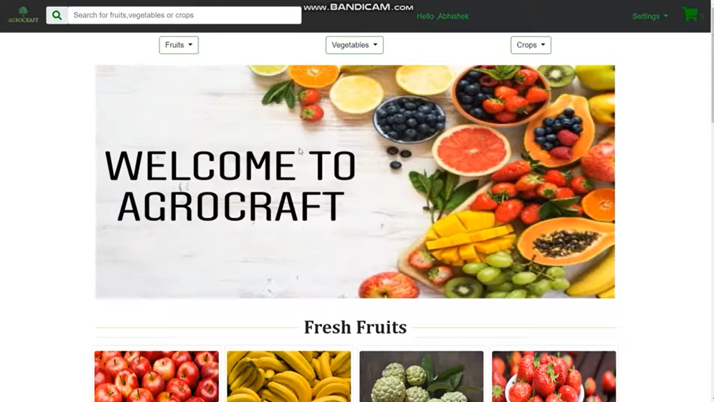
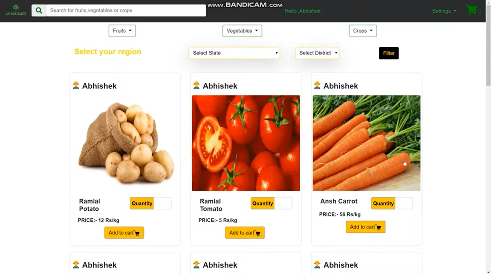
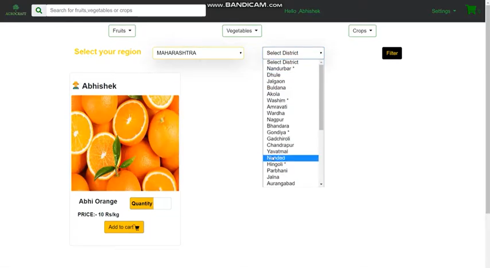

# CropConnect: An E-Commerce Website for Fresh Farm Produce, Vegetables, and Fruits

CropConnect is an e-commerce platform designed to help farmers sell their produce at better rates and enable buyers to purchase fresh farm produce through a categorical and location-based search system. One of the main goals of this project is to eliminate middlemen and provide an efficient and robust alternative to streamline the overall market flow.

## Features

- Supports CRUD operations for products uploaded by farmers.
- Completely dynamic website built with MySQL database and PHP backend.

<!-- ## Starter Images

 
     
  
   
Buyer Homepage
 

   
Products
 

   
Categorical and Location Wise Search
   

 -->

## Technology Stack

- HTML
- CSS
- JavaScript
- PHP
- Bootstrap

## Made By

- [Jai Agrawal](https://github.com/JaiAgarwal07)
- [Yuvraj Singh Rawat](https://github.com/yuvrajrawat14)
- [Keshav Singhal](https://github.com/keshav767)
